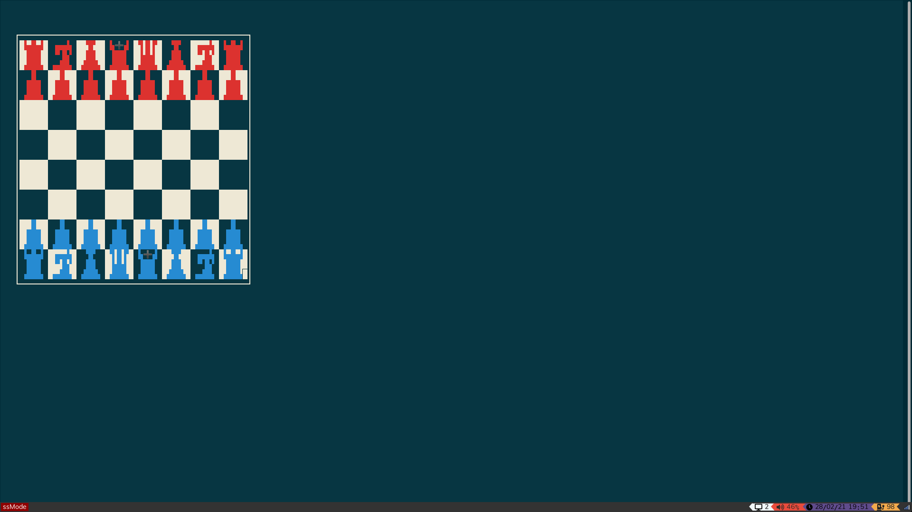

# Konsole_chess
Play chess from terminal
>written in C++

<p align="center">
    </img>
</p>
###Installation
1.Open up the terminal in your preffered directory and clone this project.
```sh
git clone https://github.com/the-WINTERSOLDIER/Konsole_chess
```
2.Enter the Konsole_chess directory.
```sh
cd ./Konsole_chess 
```
3.Run make.
```sh 
make
```
4.Run the Konsole_chess program to play 
```sh 
./Konsole_chess
```

---


